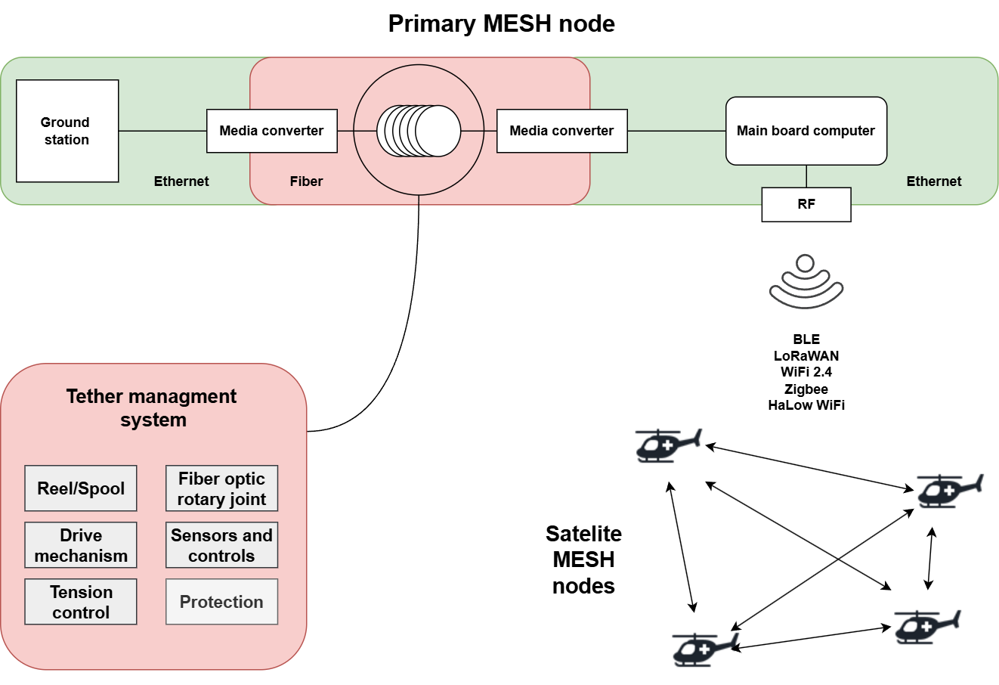

# Heterogeni komunikacijski sustav za robotske operacije u CBRNe okruženju
Ovaj repozitorij sadrži materijale, programski kod i dokumentaciju razvijenu u sklopu diplomskog rada izrađenog na **Sveučilištu u Zagrebu, Fakultetu elektrotehnike i računarstva**.

**Autor:** Viktor Horvat
**Mentor:** izv. prof. dr. sc. Matko Orsag

## 1. Uvod i cilj rada

Operacije u **kemijskom, biološkom, radiološkom, nuklearnom i eksplozivnom (CBRNe)** okruženju predstavljaju izniman rizik za ljudske timove. Upotreba multiagentskih robotskih sustava ključna je za izviđanje, nadzor i intervenciju u takvim uvjetima, no njihova učinkovitost ovisi o pouzdanosti komunikacijskog sustava, koji je često ugrožen zbog fizičkih prepreka, elektromagnetskih smetnji (EMI) ili namjernog ometanja.

**Glavni cilj** ovog rada bio je istražiti, razviti i validirati **heterogeni komunikacijski sustav** koji osigurava robusnost i kontinuitet prijenosa podataka za robotske timove u CBRNe scenarijima. Sustav je dizajniran da kombinira prednosti dvaju fundamentalno različitih komunikacijskih medija:

1.  **Optičke komunikacije putem kabela:** Pružaju iznimno visok kapacitet prijenosa i potpunu otpornost na radiofrekvencijske (RF) smetnje.
2.  **Bežične radio komunikacije:** Osiguravaju mobilnost, fleksibilnost i mogućnost proširenja operativnog dometa.

### Shematski prikaz predloženog rješenja

Rad je obuhvatio analizu dostupnih tehnologija, razvoj specijaliziranih elektroničkih i mehatroničkih komponenti, implementaciju programskog rješenja za integraciju te rigorozno testiranje cjelokupnog sustava u simuliranim operativnim uvjetima.

Rezultati su dani u sljedećoj tablici:

| Atributi                   | Wi-Fi HaLow                       | Bluetooth Low Energy | Z-Wave             | Zigbee                   | Wi-SUN                          | Sigfox                     | LoRaWAN                    | NB-IoT                    |
| :------------------------- | :-------------------------------- | :------------------- | :----------------- | :----------------------- | :------------------------------ | :------------------------- | :------------------------- | :------------------------ |
| **Frekvencija**            | Ispod 1 GHz                       | 2.4 GHz              | Ispod 1 GHz        | 2.4 GHz / Ispod 1 GHz    | Ispod 1 GHz                     | Ispod 1 GHz                | Ispod 1 GHz                | Licencirano               |
| **Brzina prijenosa (bps)** | 150 k - 86.7 M⁸                   | 125 k - 2 M          | 9.6 k - 100 k      | 250 k                    | 6.25 k - 800 k (50 k zadano)  | 100 ili 600                | 300 - 27 k                 | 20 k - 127 k              |
| **Domet (m)**              | > 1 k                             | < 100                | < 30               | < 20                     | < 1 k                           | < 40 k                     | < 10 k                     | < 10 k                    |
| **Modulacija**             | OFDM preko BPSK, QPSK, 16/64/256 QAM | GFSK                 | GFSK               | BPAK/OQPSK               | MR-FSK / MR-OFDM / MR-OQPSK     | DBPSK/GFSK                 | CSS                        | QPSK                      |
| **Trajanje baterije**      | Godine                            | Godine               | Godine             | Godine                   | Godine                          | Godine                     | Godine                     | Godine                    |
| **Sigurnost**              | WPA3                              | 128-bit AES u CCMode | Sigurnost 2 (S2)   | 128-bit AES u CCMode     | IEEE 802.1X                     | Sigurnost na razini sesije | 128-bit AES u CCMode     | 3GPP sigurnost            |
| **OTA ažuriranja firmvera**| Podržava                          | Podržava             | -                  | -                        | -                               | -                          | -                          | -                         |
| **Potrebna pretplata**     | Ne                                | Ne                   | Ne                 | Ne                       | Ne                              | Da                         | Da                         | Da                        |
| **TCP/IP (internet)**      | Podržava                          | -                    | -                  | -                        | -                               | -                          | -                          | -                         |
| **Mrežna topologija**      | Zvijezda / Releji                 | P2P* / Mreža (Mesh)  | Mreža (Mesh)       | Mreža (Mesh)             | Mreža (Mesh)                    | Zvijezda                   | Zvijezda                   | Zvijezda                  |
| **Otvoreni standard**      | IEEE 802.11ah                     | Bluetooth SIG        | Vlasnički          | IEEE 802.15.4            | IEEE 802.15.4g                  | Vlasnički                  | Vlasnički                  | 3GPP LTE Cat-NB1/NB2      |

## 2. Arhitektura sustava

Razvijeni sustav temelji se na modularnoj arhitekturi koja integrira hardverske i softverske komponente u jedinstvenu, funkcionalnu cjelinu.

### 2.1. Hibridni komunikacijski pristup

Srž rješenja je dvostruki komunikacijski kanal koji robotu omogućuje istovremeno korištenje optičke i bežične veze, osiguravajući time redundanciju i pouzdanost.

#### Optička veza (Fiber optic tether)
*   **Tehnologija:** Za prijenos podataka korišten je jednomodni (single-mode) optički kabel specificiran prema **ITU-T G.657.A2** standardu. Ovaj tip kabela odabran je zbog iznimne otpornosti na gubitke uzrokovane savijanjem, što je ključno za primjenu na mobilnom vitlu.
*   **Implementacija:** Kako bi se omogućila dvosmjerna (full-duplex) komunikacija preko jedne optičke niti i time smanjila masa i kompleksnost kabela, korištena je tehnologija **multipleksiranja po valnim duljinama (WDM)**. Implementacija je ostvarena pomoću para komplementarnih WDM medijskih pretvornika (**TP-Link MC111CS/MC112CS**), koji pretvaraju Ethernet signal u optički i obrnuto, koristeći valne duljine od 1310 nm za slanje i 1550 nm za primanje (i obrnuto za drugi uređaj).

#### Bežična veza
*   **Tehnologija:** Odabrana je **Wi-Fi HaLow (IEEE 802.11ah)** tehnologija zbog superiornih performansi u odnosu na klasični Wi-Fi (2.4/5 GHz), Zigbee ili LoRa. Ključne prednosti su:
    *   **Rad u sub-1 GHz pojasu (863-870 MHz u Europi):** Omogućuje značajno veći domet i bolju penetraciju kroz prepreke poput zidova i vegetacije.
    *   **OFDM (Ortogonalno frekvencijsko multipleksiranje):** Čini vezu otpornom na višestaznu propagaciju signala.
    *   **Podrška za 802.11s Mesh topologiju:** Omogućuje stvaranje samokonfigurirajuće i samoobnavljajuće mreže gdje roboti mogu služiti kao releji, dinamički proširujući domet i pokrivenost.
*   **Implementacija:** Korišten je evaluacijski kit **Newracom NRC7394**, visoko integrirani System-on-Chip (SoC) koji implementira cjelokupni Wi-Fi HaLow stog.

### 2.2. Mehatronički i snzorski podsustavi

Za fizičku manipulaciju optičkim kabelom i osiguravanje stabilne veze, razvijen je specijalizirani mehatronički sustav.
*   **Sustav za kontrolu napetosti:**
    *   **Aktuator:** Srce sustava je pametni servo motor **Dynamixel MX-64**, koji omogućuje preciznu kontrolu momenta (struje), brzine i pozicije. Motor je integriran s 3D printanim vitlom za namatanje kabela.
    *   **Senzor:** Na letjelici je postavljena **mjerna ćelija (load cell)** kapaciteta 10 kg, koja kontinuirano mjeri silu napetosti kabela.
    *   **Obrada signala:** Analogni signal iz mjerne ćelije pojačava se i digitalizira pomoću 24-bitnog ADC modula **HX711**. Cjelokupnim procesom akvizicije upravlja mikrokontroler **ESP32 Nano**, koji obrađene podatke o sili šalje putem serijske veze.

### 2.3. Platforma i centralna jedinica

*   **Procesorska jedinica:** Kao centralni "mozak" sustava na letjelici i na baznoj postaji korišteno je računalo **Raspberry Pi 4B**. Ono izvršava operativni sustav, upravljačke programe i aplikacijski sloj (ROS 2).
*   **Robotska platforma:** Sustav je integriran i testiran na zračnom robotskom okviru **Hexsoon EDU-450**, koji je odabran zbog svoje modularnosti, nosivosti i kompatibilnosti s otvorenim standardima za autopilote.

## 3. Programsko rješenje

Softverska arhitektura osmišljena je za modularnost, fleksibilnost i integraciju unutar standardnog robotskog ekosustava.

### 3.1. Operativni sustav i upravljački programi

*   **OS:** Korišten je **Raspberry Pi OS (Bookworm)** s Linux jezgrom verzije 6.6.
*   **Upravljački program za HaLow:** Za funkcionalnost NRC7394 kartice, kompajliran je i instaliran specifični jezgreni modul (`nrc.ko`). Ovaj modul integrira HaLow hardver u standardni Linux bežični podsustav (`mac80211`), omogućujući da se HaLow sučelje (`wlan0`) konfigurira standardnim Linux alatima (`wpa_supplicant`, `hostapd`).

### 3.2. Robotski operacijski sustav (ROS 2)

Aplikacijski sloj za upravljanje i razmjenu podataka implementiran je unutar **ROS 2 (Jazzy Jalisco)** radnog okvira. Zbog nedostatka službenih binarnih paketa za Raspberry Pi OS, ROS 2 je izgrađen izravno iz izvornog koda.

Razvijena su dva ključna ROS 2 paketa koji čine zatvorenu upravljačku petlju za kontrolu napetosti:
1.  **`esp32_load_cell` (Python):**
    *   Ovaj ROS 2 čvor (`SerialReaderNode`) kontinuirano čita podatke o sili sa serijskog porta na koji je spojen ESP32.
    *   Podatke parsira i publicira na ROS 2 temu `/serial_esp_data` kao `std_msgs/msg/String` poruku.
2.  **`dynamixel_mx64_control` (C++):**
    *   Čvor `DynamixelController` pretplaćen je na temu `/serial_esp_data`.
    *   Nakon primitka poruke, parsira vrijednost sile i primjenjuje funkciju skaliranja kako bi izračunao potrebnu ciljanu struju za motor (Goal Current).
    *   Koristeći **DynamixelSDK** biblioteku, šalje naredbu motoru da postavi izračunatu struju, čime se regulira napetost kabela.
    *   Dodatno, čvor periodički očitava status motora (poziciju, brzinu, struju) i publicira ga na temu `/motor_status` za nadzor.

### 3.3. Konfiguracija mrežnog sloja (CycloneDDS)

ROS 2 koristi **DDS (Data Distribution Service)** kao temeljni komunikacijski sloj. Zadani DDS (CycloneDDS) u standardnoj konfiguraciji koristi multicast za otkrivanje čvorova, što može biti nepouzdano na Wi-Fi mrežama, osobito u Mesh topologiji. Kako bi se osigurala deterministička komunikacija, korištena je vanjska XML konfiguracijska datoteka za CycloneDDS kojom je:
*   Onemogućen multicast za otkrivanje čvorova (`SpdpMulticast = false`).
*   Eksplicitno definirane IP adrese `peer` čvorova, osiguravajući direktno uspostavljanje veze.

## 4. Integracija i rezultati testiranja

Sustav je podvrgnut nizu testova kako bi se verificirala funkcionalnost i performanse svake komponente i cjeline.

### 4.1. Testiranje sustava za kontrolu napetosti

*   **Metodologija:** Razvijeni sustav za mjerenje napetosti (mjerna ćelija + ESP32) uspoređen je s referentnim, visoko-preciznim šestoosnim senzorom sile **Optoforce**. Oba senzora mjerila su napetost istovremeno.
*   **Rezultati:** Grafički prikazi (Slika 6.8 i 6.9 u radu) pokazuju izvrsnu korelaciju između mjerenja razvijenog sustava i referentnog senzora, čime je potvrđena njegova funkcionalnost i točnost za zadanu primjenu. Testiranje je također otkrilo ograničenje maksimalne linearne brzine vitla od **4.9 cm/s**, što je ključan podatak za buduća poboljšanja.

### 4.2. Testiranje opornosti optičkog kabela

*   **Metodologija:** Kabel G.657.A2 namotan je na vitlo radijusa 7.5 mm (minimalni specificirani radijus), te je mjerena mrežna propusnost pomoću alata `iperf3` nakon svakog namotaja.
*   **Rezultati:** Nije zabilježen pad performansi čak ni pri maksimalnom broju namotaja. Propusnost je konstantno bila na teorijskom maksimumu Ethernet veze od ~94 Mbps (Slika 6.5 u radu), potvrđujući da dizajn vitla i odabir kabela ne unose značajne gubitke.

### 4.3. Testiranje performansi Wi-Fi HaLow

Testiranje je provedeno na poligonu Ravnateljstva civilne zaštite u Jastrebarskom.
*   **LOS (Line-of-Sight) Scenarij:** Uspostavljena je stabilna veza s dva uređaja na udaljenosti do **350 metara**, uz propusnost dovoljnu za prijenos telemetrije i kontrolnih signala.
*   **NLOS (Non-Line-of-Sight) i Mesh Scenarij:**
    *   Uvođenjem trećeg uređaja koji je služio kao **MAP (Mesh Access Point)**, domet sustava uspješno je proširen na impresivnih **500 metara** u uvjetima bez optičke vidljivosti.
    *   Na toj udaljenosti, uz jedan "skok" (hop) preko MAP-a, izmjerena je stabilna propusnost od oko **1 Mbps**. Ova brzina je dovoljna za istovremeni prijenos telemetrije, kontrolnih signala i video prijenosa standardne rezolucije.
*   **Zaključak testiranja:** Testovi su nedvojbeno pokazali izvedivost i robusnost Wi-Fi HaLow tehnologije, a posebice njezine Mesh funkcionalnosti, za proširenje operativnog dometa robotskih sustava u realističnim, ometajućim okruženjima.

## 5. Zaključak rada

Ovaj diplomski rad uspješno je demonstrirao dizajn, implementaciju i validaciju **heterogenog komunikacijskog sustava** za robotske operacije. Ključni doprinosi rada su:
*   **Sinergija tehnologija:** Pokazano je da kombinacija optičke veze otporne na smetnje i dugometne, samokonfigurirajuće bežične Mesh mreže pruža visoku razinu **pouzdanosti, redundancije i fleksibilnosti**.
*   **Cjelovito rješenje:** Razvijen je kompletan sustav, od mehatronike za upravljanje kabelom do složenog programskog rješenja temeljenog na ROS 2, koji integrira sve komponente u funkcionalnu cjelinu.
*   **Praktična validacija:** Performanse sustava potvrđene su kroz rigorozno testiranje u realističnim uvjetima, dokazujući njegovu primjenjivost za zahtjevne CBRNe scenarije.

Predloženi sustav predstavlja temelj za budući razvoj autonomnijih i sposobnijih robotskih timova koji mogu sigurno i učinkovito djelovati u najopasnijim okruženjima.

diplomski na overleafu:
https://www.overleaf.com/read/jkqhyxytmrxt#3c8907
